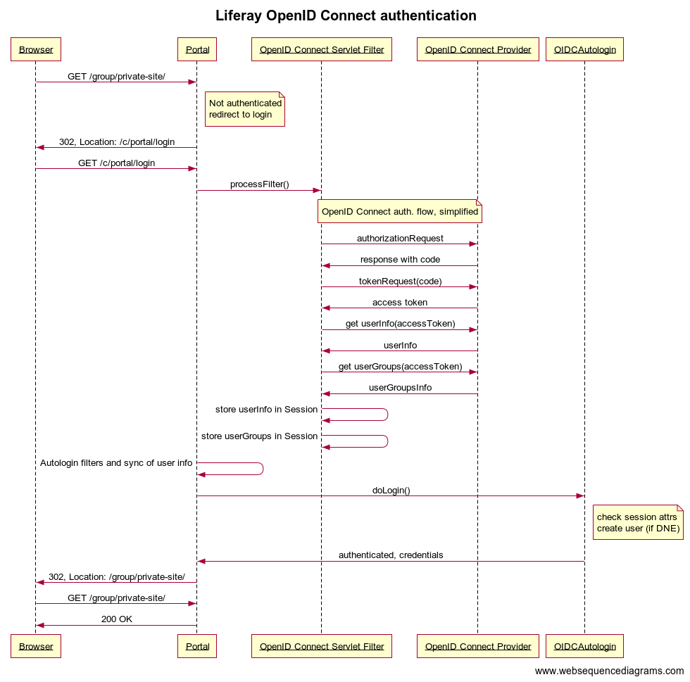

# Azure AD for liferay 6.2 OpenID Connect Liferay plugin 

This is a modified version of the plugin uses the OpenID Connect protocol to make Liferay use external authentication sources like social networks and SSO systems.
It is [available in the Liferay Marketplace](https://web.liferay.com/marketplace/-/mp/application/78695724). Original [repo](https://github.com/finalist/liferay-oidc-plugin). 
This project is intended to use with liferay 6.2, this includes a simple synchronization of the users from
azure ad default directory. for version 7.0 has not been developed this feature.

## Introduction

The OpenID Connect protocol delegates authentication to a so called Provider, and supplies the requesting application (in our case: Liferay) with an access token (like a temporary, restricted password) to request additional user information.
 With this user information, a Liferay-account is created if it does not exist, and to Liferay the user authentication is confirmed. 

### Components

The plugin comprises of two parts:

* a Servlet Filter (using Liferay's servlet filter hook) to intercept the normal login flow and redirect to the OpenID Connect provider, get the access token and get user information 
* an Autologin to complete the authentication

### Configuration

Configuration differs between 6.2 and DXP/7.0+.

#### For 6.2

In Liferay 6.2, the configuration of the plugin is driven by portal properties defined below.
Normally they should be set in `portal-ext.properties`.

##### Virtual portal instances
If a setup is required for multiple _virtual portal instances_ where each virtual instance has its own settings regarding OpenID Connect, you can make use of the company-specific portal properties setup, [as documented here](https://docs.liferay.com/portal/6.2/propertiesdoc/portal.properties.html#Properties Override). 
It boils down to adding the system property `-Dcompany-id-properties=true` to the startup command. Keep in mind though that enabling the plugin in `portal-ext.properties` and not disabling it specifically in a certain virtual instance's `portal-{webId}.properties` will effectively enable it there as well.

##### Portal properties
The following portal properties can be set. They are required unless specified as optional.

`openidconnect.enableOpenIDConnect`

Whether to enable the plugin (effectively allowing you to disable the plugin without uninstalling it). Boolean, either 'true' or 'false'. Default is false.

`openidconnect.authorization-location`

Complete url to the OpenID Connect Provider's authorization location. Example for Google: `https://accounts.google.com/o/oauth2/v2/auth`

`openidconnect.token-location`

Complete url to the OpenID Connect Provider's token location. Example for Google: `https://www.googleapis.com/oauth2/v4/token`

`openidconnect.profile-uri`

Complete URL to the 'user info' endpoint. Example for Google: `https://www.googleapis.com/plus/v1/people/me/openIdConnect`

`openidconnect.sso-logout-uri` (Optional)

`openidconnect.sso-logout-param` (Optional)

`openidconnect.sso-logout-value` (Optional)

Complete URL to the 'SSO logout' endpoint. Ignored if empty.
After redirection to the given URL, the OpenID Connect Provider should redirect to the Lifery Portal home page (or another public after-logout-resource).
This target may be included in this URL as a URL parameter or may be configured for the OpenID Connect Provider.

`openidconnect.issuer`

The information retrieved from the user info endpoint has to be verified against a preconfigured string, according to the OpenID Connect spec.
This 'issuer' claim is used for that. Example for Google: `https://accounts.google.com`

`openidconnect.client-id`

Register your Liferay portal as a 'client app' with the Google developer console, and the resulting client id is the openid connect client id.
Non-working example for Google: `7kasuf1-123123adfaafdsflni7me2kr.apps.googleusercontent.com`

`openidconnect.secret`

Secret of the client, after registration of the Liferay portal, just like the client-id.

`openidconnect.scope`

Scope(s) of the access token (space separated), should be the same (or a subset) of the scopes allowed by the provider to the client. Default value: `openid profile email`

`openidconnect.provider` (Optional)

Type of OpenID Connect provider. Supported values: `generic` (default), `azure`. For most Provider implementations, the generic provider works. For Azure, use the value `azure` as this makes slight changes to the fields sent as UserInfo.
Use `azure-default` if you want to connect using the default API of azure.

`openidconnect.openidconnect.user-membership-location` (Needed when you use azure-default)

If you use `azure-default` as provider include the url to connect to microsoft graph api.

#### Complete copy-paste-friendly code block with all required properties
~~~
openidconnect.enableOpenIDConnect=true
openidconnect.token-location=https://www.googleapis.com/oauth2/v4/token
openidconnect.authorization-location=https://accounts.google.com/o/oauth2/v2/auth
openidconnect.profile-uri=https://www.googleapis.com/plus/v1/people/me/openIdConnect
openidconnect.issuer=https://accounts.google.com
openidconnect.client-id=7kasuf1-123123adfaafdsflni7me2kr.apps.googleusercontent.com
openidconnect.secret=xyz
openidconnect.scope=openid profile email
~~~

#### Complete copy-paste-friendly code block with all required properties for azure ad default
~~~
openidconnect.enableOpenIDConnect=true
openidconnect.token-location=https://login.microsoftonline.com/{TENANT-ID}/oauth2/v2.0/token
openidconnect.authorization-location=https://login.microsoftonline.com/{TENANT-ID}/oauth2/v2.0/authorize
openidconnect.profile-uri=https://graph.microsoft.com/oidc/userinfo
openidconnect.user-membership-location=https://graph.microsoft.com/v1.0/me/memberOf
openidconnect.issuer=https://login.microsoftonline.com/{TENANT-ID}/v2.0
openidconnect.client-id={APP-REGISTRATION-ID}
openidconnect.secret={APP-SECRET}
openidconnect.scope=openid profile email
openidconnect.provider=azure-default
openidconnect.sso-logout-uri=https://login.microsoftonline.com/{TENANT-ID}/oauth2/v2.0/logout
~~~

### Try out with Google as OIDC Provider

* Create a project at https://console.developers.google.com/apis/dashboard, of type 'web application'
* Create credentials, of type 'OAuth Client ID'
    * Application type: 'web application'
    * Name: anything, like 'My Liferay portal'
    * Authorised redirect URIs: `http://localhost:8080/c/portal/login` (or any public URL, but it has to end in the Liferay's special path `/c/portal/login`)
    * Copy-paste the created client credentials into your portal-ext.properties or in the control panel's Instance Settings
* Add/enable the Google+ API (from dashboard, click button 'Add API' -> Choose 'Google+')
* Configure the plugin with the rest of the properties, as stated above.

### Try out with Azure as OIDC Provider

* Create a project at https://portal.azure.com/#home, register an application
    * Include Name 
    * Accounts in this organizational directory only (Default Directory only - Single tenant)
    * Redirect URI: `http://localhost:8080/c/portal/login` (or any public URL, but it has to end in the Liferay's special path `/c/portal/login`) 
    * Copy-paste the created registration into your portal-ext.properties
    * Remember to include the microsoft certificates in you liferay to be able to consume Azure API  

### Sequence diagram
This diagram focuses on the interaction of typical Liferay components and components of the plugin. 
It simplifies the actual OpenID Connect authorization code flow a bit, which is documented properly in other locations.

Sequence diagram rendered by https://www.websequencediagrams.com/, with source code:
~~~
title Liferay OpenID Connect authentication

Browser->Portal: GET /group/private-site/
note right of Portal
    Not authenticated
    redirect to login
end note
Portal->Browser: 302, Location: /c/portal/login
Browser->Portal: GET /c/portal/login
Portal->OpenID Connect Servlet Filter: processFilter()
note over OpenID Connect Servlet Filter, OpenID Connect Provider: OpenID Connect auth. flow, simplified
OpenID Connect Servlet Filter->OpenID Connect Provider: authorizationRequest
OpenID Connect Provider->OpenID Connect Servlet Filter: response with code
OpenID Connect Servlet Filter->OpenID Connect Provider: tokenRequest(code)
OpenID Connect Provider->OpenID Connect Servlet Filter: access token
OpenID Connect Servlet Filter->OpenID Connect Provider: get userInfo(accessToken)
OpenID Connect Provider->OpenID Connect Servlet Filter: userInfo
OpenID Connect Servlet Filter->OpenID Connect Provider: get userGroups(accessToken)
OpenID Connect Provider->OpenID Connect Servlet Filter: userGroupsInfo
OpenID Connect Servlet Filter->OpenID Connect Servlet Filter: store userInfo in Session
OpenID Connect Servlet Filter->OpenID Connect Servlet Filter: store userGroups in Session
Portal->Portal: Autologin filters and sync of user info
Portal->OIDCAutologin: doLogin()
note right of OIDCAutologin
    check session attrs
    create user (if DNE)
end note
OIDCAutologin->Portal: authenticated, credentials
Portal->Browser: 302, Location: /group/private-site/
Browser->Portal: GET /group/private-site/
Portal->Browser: 200 OK
~~~

### License
This software is licensed under the Apache 2 license.

